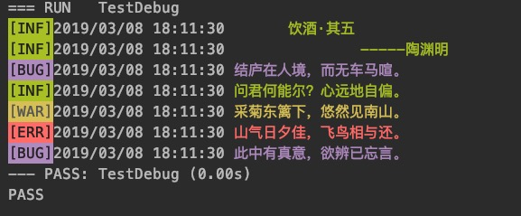

# logcolor彩色日志
> 带有颜色的日志, 分四个等级, debug < info < warning < error


# 基本应用
```
logcolor.Info("      饮酒·其五     ")
logcolor.Info("              -----%s", "陶渊明")
logcolor.Debug("结庐在人境，而无车马喧。")
logcolor.Info("问君何能尔？心远地自偏。")
logcolor.Warning("采菊东篱下，悠然见南山。")
logcolor.Error("山气日夕佳，飞鸟相与还。")
logcolor.Debug("此中有真意，欲辨已忘言。")
```

## 输出效果


# 自定义扩展彩色日志

## 输出到buffer里
```
//把结果输入到buffer里
buff := new(bytes.Buffer)
lg := New(buff, true)
lg.Warning("人间正道是沧桑")
//输出结果
fmt.Print(buff.String())
```

## 自定义等级

```
lg := New(os.Stdout, true)
lg.SetLevel(INFO)
lg.Info("人生如逆旅，我亦是行人-------------%s", "出自宋代苏轼")
lg.Debug("输不出来的")
lg.SetLevel(DEBUG)
lg.Debug("我胡汉三又回来了")
```